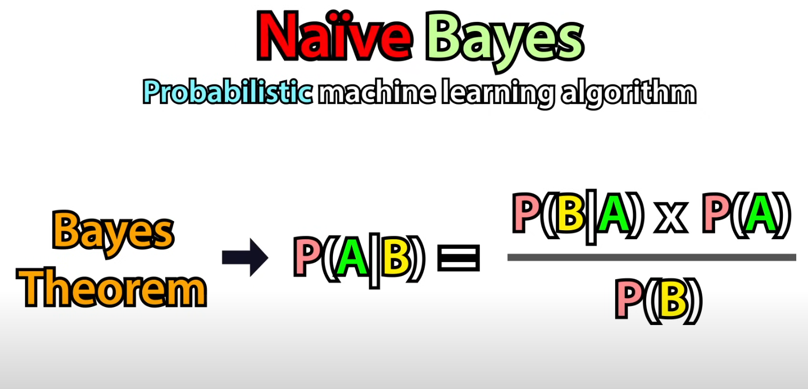
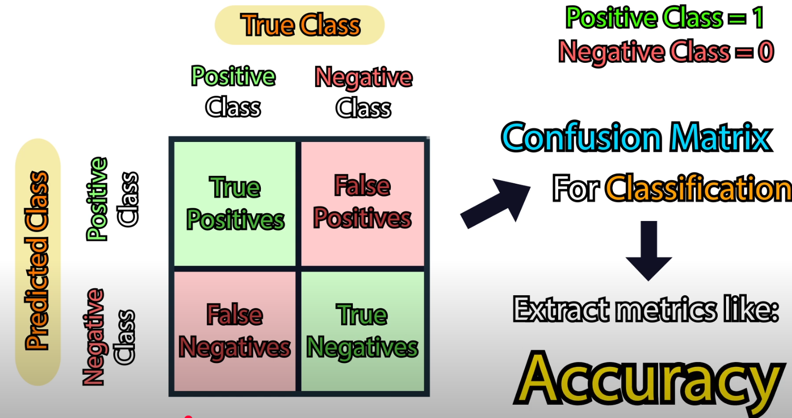

# What is ML?

---
Author: Marc-Antoine Fortin, April 2025.  
Email: marc.a.fortin@ntnu.no  
Github: @mafortin

---

- ML algorithms: training algorithms that rely on statistical concepts to solve rather simple tasks  
	- E.g., Linear/Logistic Regression, Decision Trees, Random Forests, k-Nearest Neighbors, etc.  
	- Pros:  
		- Easier to use  
		- Easier to interpret;  
		- Works well with tabular data;  
	- Cons:  
		- Limited capacity for pattern extraction/recognition  
- Deep Learning (DL):  
	- Subset of ML focusing **only on Neural Networks**.

  
- In recent years, it has become **THE** dominating tool for handling complex data.

---

## Overview of most ML models

### Regression Models:

1) **Linear regression**

- Simplest ML model;

  
- Can use x^n with n>1, becoming polynomial regression that can capture non linear behaviors;  
- Ridge, Lasso and Elastic Net are regularization techniques to combat overfitting.

---

### Classification Models:

1) **Logistic Regression**  
- Despite its name, it's a classification model used for binary classification (e.g., cat or dog).  

  
- Based on a predetermined threshold, the model classifies whether it is a "positive" or "negative" classification.

  
- Error/loss function is Cross-Entropy since the labels are categorical and not continuous.  
- Can handle multi-class classification by changing the sigmoid into a softmax function.  
	--> Multinomial Logistic Regression.  
	- N_{k} > 1

  

2) **Naive Bayes**  

- "Naive":

  
- E.g., Does the sentence "This place feels disappointing" have a negative or positive meaning?  
	- It assumes all words are independent from each other.

  
- Simplifcation that allows for computing this equation (otherwise extremely more computationally expensive):  
  

- Three types of Naive Bayes:  

---

### Both regression and classification models:

1) **Decision Tree**:

  
- The tree uses one feature to split the data as much/evenly as possible.  
	- The quality of each split is evaluated by "impurity" measures.  
		- E.g., Gini impurity, Entropy, etc.  
- To combat overfitting, one can:  
	- Pre-prune it;  
		- Limit the number of decisions/deth of the tree beforehand.  
		- AKA early stopping  
	- Post-prune it;  
		- I.e., remove branches that add little value after training  
- Not the best option for regression;  
	- Quite sensitive to over and underfitting.  
	- Produces 'step functions'-type of regression, which is not regularly desired.

2) **Random Forests**:  
  
- Combines several Decision trees together;  
- Each decision Tree is trained with a subset of the full training dataset called 'bootstrap samples' which are random samples of the training dataset of the same size but with replacements.

- For classification:  

- For regression:  

- Advantages:  
	- Less prone to overfitting than decision trees;  
	- Can get 'Feature Importance' scores (to know which feature matters the most)  
- Disadvantages:  
	- Less interpretable than decision trees;  
	- Computationally more expensive since several decision trees are trained;  
	- More Hyper-Parameters (HP) than previous models.

3) **Support Vector Machines (SVM)**  
  
- Advantage: Very powerful  
- Disadvantages:  
	- Requires careful HP tuning;  
		- Kernel type, C value, Gamma, k-distance points, distance metric  
			- Increasing C and Gamma --> more overfitting

- For regression:  
	- Support Vector Regressor:  
	

	- K-Nearest Neighbors:  
		- Belongs to the "lazy learning algorithms" class  
			- I.e., you don't train a kNN model, you just use the data directly.  
			- **Major** disadvantage: Prediction is slow, especially for large data since you have to 'calculate' the answer for every single prediction.  
		- Smaller K --> higher chance of overfitting  
		- Larger K --> higher chance of underfitting  
		

4) **Ensemble Methods**:  
- The concept is simple: the more (models), the merrier. You combine several models together basically.  
- 4 main types: Bagging, Boosting, Voting and Stacking.  
	- Bagging --> Random Forest  
		- A way to reduce overfitting even if individual decition trees were overfitting since their contribution is weighted to a lower weight since there are N other trees.  
	- Boosting:  
		- Combining several 'weak' models without randomization.  
		- Higher accuracy models are given a larger weight for predictions:  
		
	- Voting  
		- Combining different types of models together through 'hard' or 'soft' voting.  
			- 'Hard' voting --> Majority class voting between models  
			- 'Soft' voting --> Class probably summation of all models + highest total class probablity = winning class.  
	- Stacking --> basically what the nnUNet is doing with the 5-fold cross-validation  
		  
			- E.g., here we can use 5 different models with the same training data for the base models OR we can use 5 different fold of data for the same 5 base models (e.g., the nnUNet).  
		- Disadvantages:  
			- Slow;  
			- Interpretability is lower since you combine several models, and sometimes, even different models.

3) **Neural Networks**:  
	- Can be seen as a (highly) more complicated version of logistic regression:  
		  
			- If you remove the sigmoid function, it is simply a **linear regression**.  
	
	- What makes NN different from logistic regression is their **hidden layers**:  
		  
		- This is a Fully Connected Neural Networks.  
		- Each weight (w) is a parameter of your model/function.  

- Without **activation function**, each layer would jsut perform a linear transformation.  

	- F.eks. node z_1 from above would be this:  
		  
	- Which would then give something like this:  
		  
			- Hence, adding an activation function to introduce non-linearity (e.g., ReLU):  
				  
	- NN learns through a process called  **backpropagation** where the model adjusts its weights and biases by minimizing a loss function.  
		

- Advantages:  
	- **EXTREMELY** powerful and versatile:  
		  
	- Very scalable (i.e., easy to increase the number of layers and parameters)  
- Disadvantages:  
	- Prone to overfitting if the model is too complex (e.g., too many hidden layers)  
	- HP fine-tuning can be computationally and/or time expensive  
	- Grid search vs randomized search:  
		

---

### Unsupervised models:

- For all previous methods/models, we had an **Input** --> **Target** combination like this: 
- But for unsupervised learning, we do not define a target: 

1) **Clustering**:
    - Most popular techniques: **K-Means** 
    - You need to manually define k. Then, randomly choose the k cluster centers. Finally, calculate the distance for each point to each cluster center (or centroid). Assign the point to the closest cluster center. Repeat iteratively until the cluster centers do not significantly move.
    - Disadvantages:
        - Defining a bad k value: 
        - Slow on large datasets
    - **Fundamental clustering algorithm**
        - Many variations exist to address some of the drawbacks.

2) **Principal Component Analysis (PCA)**:

- Dimensionality reduction problem:
    - That means, it tries to reduce the number of features while preserving as much information as possible about the data.
    - PCA transforms the data into a new set of variables called Principal Components which are uncorrelated/independent from each other.
        - That means there is no overlap in information between each other PC.
    - 
    - PC1 always captures the most information. PC2 being the second, PC3 the third, etc.
    - PCs linearly combine the original features together: 
        - The math behind is based on Eigenvalues and eigenvectors and can be quite intensive.

---

### Miscellaneous concepts related to ML

#### Loss function:

- **Definition**: Simply, it is the mathematical function that provides feedback about how well our model is doing/learning.
    - The loss function mathematically compares the prediction to the target/ground truth.

- Two types of loss functions:
    1) For Regression:
        - Simplest type since you can compare two numerical values by subtracting them, for example.
        - Most common loss functions: Mean Absolute Error (**MAE**) and Mean Squared Error (**MSE**)
    2) For Classification:
        - Here, we need to compare "classes" instead of numbers.
        - Common loss function: **Cross-Entropy** 
        - Here is an example for binary CE: 
        - Here for multi-class (N_classes > 2) CE: 
    - Many other losses exist, here are just a few examples of the most common ones.

---

#### How to evaluate an ML model?

- Common tool for classification task: **Confusion Matrix** 

- What is Accuracy? 
- Mathematically: 

- But **Accuracy** isn't everything...
    - Let's say hypothetically, you create a model that predicts whether someone has the flu or not. There are 100,000 people in total and only 100 people with the flu. Now, assume you did a poor job, and your model assigns 0 person with the flu.
        - You will get this confusion matrix: 
            - This results in an accuracy of 99.9%, which is great in theory.
            - **HOWEVER**, we missed 100% of the actual sick people (true positives), so our model is completely useless in practice!
            - So, in practice, you'd be better to have a model that would assign someone as 'sick' when they are not (False Positive) than 'healthy' when actually sick (False Negative).
                - This is where **Recall** and **Precision** come in!

- The difference between both is in the denominators.

- **Recall**: High Recall --> Minimizes False Negatives
    - I.e., doesn't predict someone who is sick (Positive) to be healthy (Negative).
        - This is what matters in **diagnostic** applications like detecting the flu or COVID.
            - You want to maximize the detection of positives, to the possible cost of increasing the detection of False Positives.
            - I.e., you want to maximize Recall over Precision.

- **Precision**: High precision --> Minimizes False Positives
    - I.e., doesn't predict someone to be sick (Positive) when they are healthy (Negative)

- **F1-score**: maximizes both Recall and Precision
    - Computes the harmonic mean of both metrics.
        - I.e., if one of the two is quite low, F1 will be quite low. You need both to be high to get a high F1-score.

- In conclusion, you should use:
    - **Accuracy**: when you have a balanced dataset (between classes)
    - **Precision**, **Recall** and **F1-score**: when using unbalanced datasets (i.e., when classes don't have the same weight/frequency).
    - Other metrics like Area Under the Curve (**AUC**) or Receiver Operating Characteristic (**ROC**) are also very important!

- For multi-class data, different evaluation techniques exist. 

---

#### What are Gradient Descent Algorithms?

- **IMPORTANT QUESTION**: How does 'training' actually work for ML/DL algorithms?

    1) Randomly assign a value to each weight.
    2) Use these weights in your model to make a prediction.
        - In other words, feed your training data to your model (with those weights) and measure the output.
    3) Measure the error in the said predictions with the [loss function]. 
        - If you have **supervised** learning, you can measure the discrepancy between the prediction and target/ground truth mathematically.
        - **Note**: The error/loss function needs to be **differentiable** since we will compute its partial derivatives in the next step.
    4) Calculate the **gradient** of the error/loss function with respect to each weight.
        - Without jargon, what does that mean?
            - Simply, the **gradient of the loss function** (or any function in general) indicates the **direction** and **rate** at which the **loss function increases most rapidly**. 
                - Thus, by moving in the **opposite direction of the gradient**, we can minimize the loss function, thereby improving the model's performance.
                - So, it tells you (1) how far and (2) where (direction) to go if you want to improve your model.
                - When the rate gets lower, it means that you are getting closer to the minimum for your loss function.
    5) Update all weights individually such that the loss function is reduced.
        - Like this: 
            - where w was the previous weight, alpha, the learning rate which is multiplied by the gradient of the loss function in respect to the weight w.
                - This step is done for every single weight.
            - **Note**: The speed/step size at which the weights will be updated is directly related to the **learning rate** (LR) as shown above.
    6) Repeat iteratively until you reach the most optimal solution (when you have minimized the loss function, i.e., found its **global minima**).
        - For example, here for a hypothetical loss/error function where we only have one variable (X), you can easily identify the global from the local minima: 
            - However, in practice, our loss/error function includes hundreds or thousands (if not millions!!) of variables, making it **extremely** hard (or even impossible in practice) to find **THE** global minima.
                - Hence, we hope/settle to find one of the best local minima in the extremely (I feel like I can't repeat that enough) complex loss/error function.
                - If you have 1000 variables/parameters, that means you have 1000 dimensions to your loss/error function.

- **Types of Gradient Descent algorithms**:
    1) Batch Gradient Descent;
        - Use the entire dataset to compute the gradient of the loss function to update the parameters.
        - You do that once per epoch.
        - Pros:
            - More deterministic convergence
        - Cons:
            - Prone to local minima
            - Problematic for non-convex functions.
            - Requires a huge amount of resources to fit all the dataset.
    2) Stochastic Gradient Descent:
        - You randomly take one observation from the dataset to compute the gradient and then update your weight.
            - Thus, if you have N datapoints, you will update N times your parameters/weights during one epoch.
            - Pros:
                - Random selection of observations can avoid local minima for non-convex functions
                - Can converge faster in some cases.
            - Cons:
                - Can favor a few observations resulting in a temporarily increased loss function before reaching the minima (shark-teeth-like function).
                - Due to the random/noisy aspects of the selection process, you might never reach the actual minimum spot inside the global minima while 'being very close to it' (you're jumping/hovering around it randomly).
    3) Mini-batch Gradient Descent:
        - Combination of both previous types:
            - Take a predefined number of samples/observations randomly selected from the dataset (**batch-size**, which is a user-defined HP) to update the parameters.
        - Kinda the best of both worlds:
            - Randomness helps to explore more of the parameter space of the loss function (i.e., avoids local minima)
            - Better gradient approximation since more observations are included in the calculations (i.e., less jumpy/erratic loss function)

- Here is a comparison of the three algorithms and the resulting loss function in its hypothetical error plane:
    - Black --> Batch;
    - Green --> Stochastic;
    - Blue --> mini-batch. 

---
